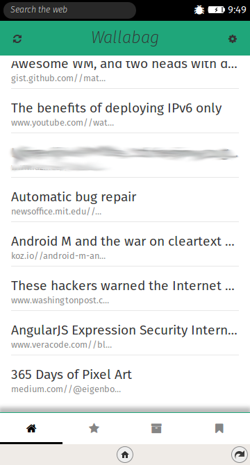
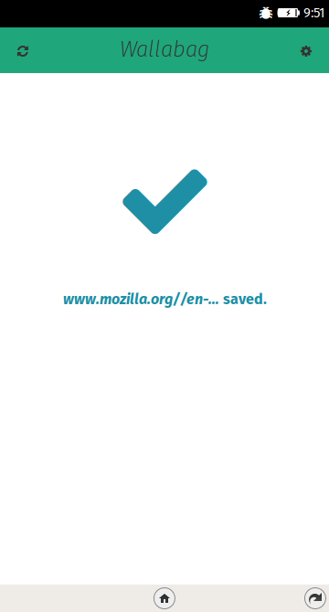
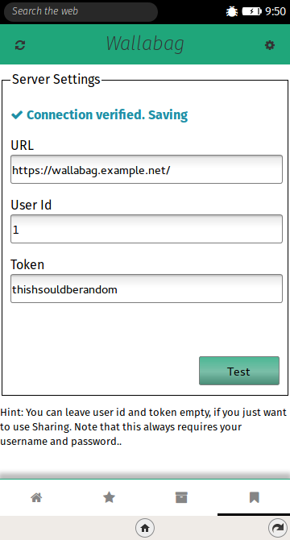

# *Wallabag* for Firefox OS
This app serves as a [wallabag](https://www.wallabag.org/) client for Firefox OS and other HTML/JS runtimes. Wallabag is a web-application for self-hosted reading list & bookmarking.

## Installation (BETA and Release Candidates)
* Download the latest release (e.g. [wallabag-1.0.0-rc1.zip](https://github.com/freddyb/wallabag-fxos/archive/1.0.0-rc1.zip))
* Unzip
* **On your phone**[^1]: Go to Settings → Developer and enable Debugging via 
* [Open WebIDE in Firefox](https://developer.mozilla.org/en-US/docs/Tools/WebIDE/Opening_WebIDE) on your Desktop computer
* Click *Select Runtime* on the top right and select your phone. If you phone is not available, see this [Troubleshooting Guide](https://developer.mozilla.org/en-US/docs/Tools/WebIDE/Troubleshooting)
* Once your phone is connected, click Project → Open Packaged App and select the wallabag-fxos folder
* Click the "Play" button (right arrow) to install wallabag-fxos on your device.
* Once the app has been installed, you can disconnect your device.
* Remember to disable debugging in your phone settings!

[^1]: You can also install wallabag-fxos on an Firefox OS Simulator for testing, debugging and development. See the [WebIDE documentation](https://developer.mozilla.org/en-US/docs/Tools/WebIDE) for setting up runtimes.

## Screenshots
### This is the reading list.

### Sharing through WebActivities works.

### The settings require long and unwieldy text input.

